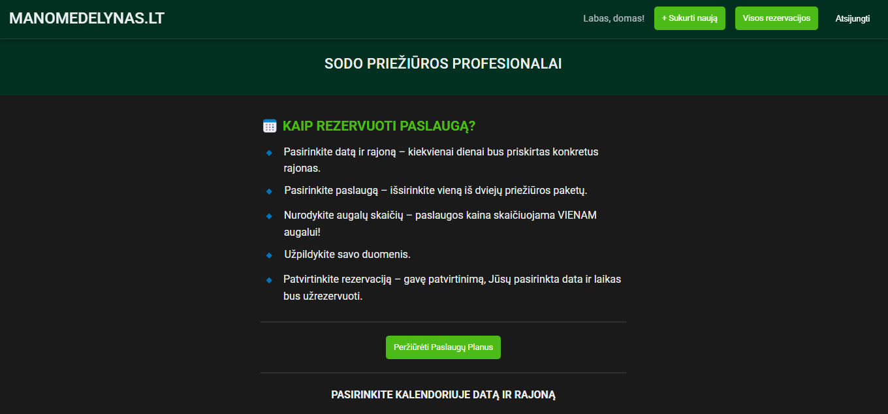
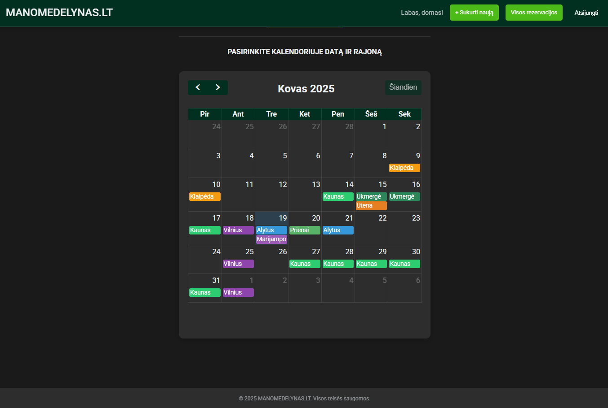
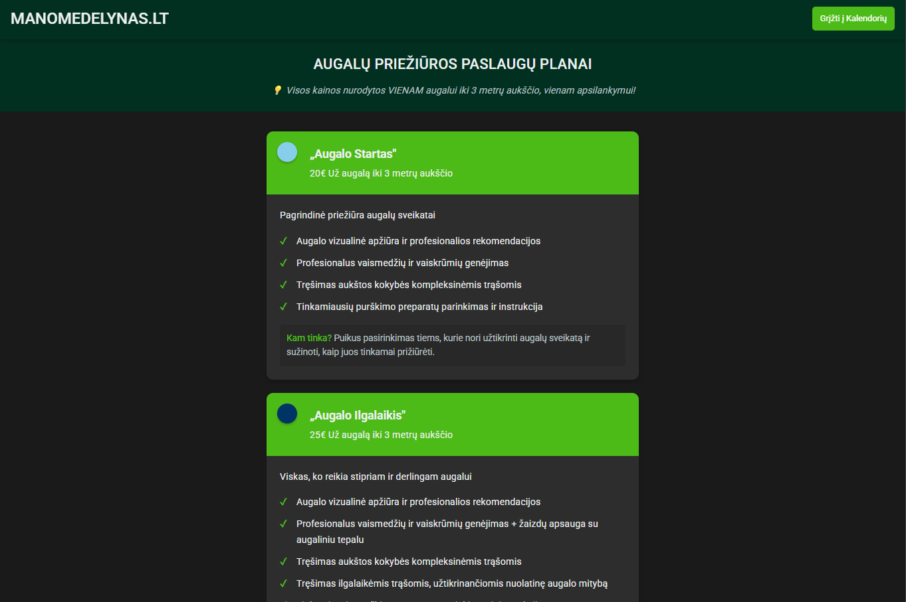
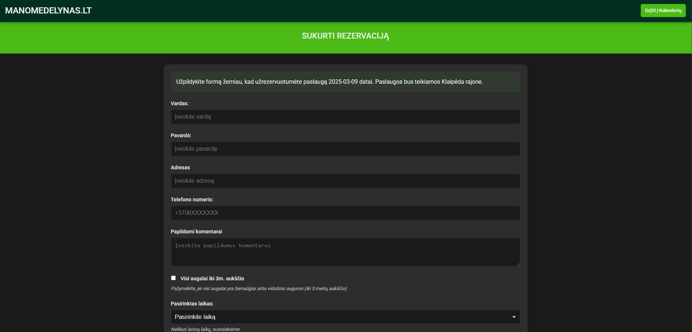
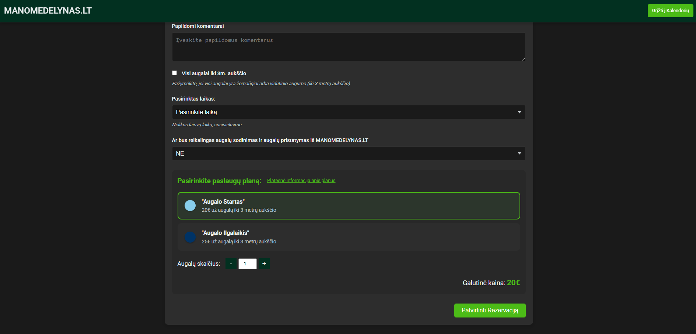
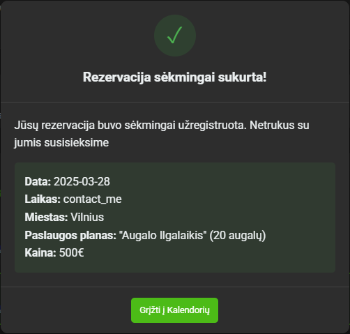
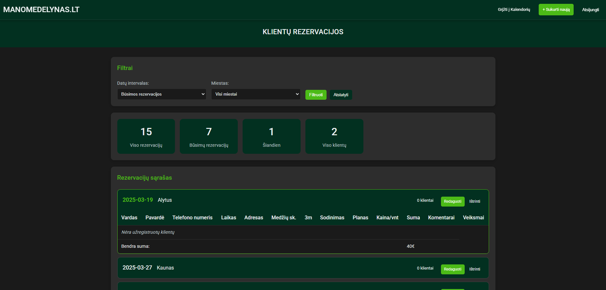

# Overview
MANOMEDELYNAS.LT Reservation System is a comprehensive web application designed to streamline reservation management for plant care services. The system allows customers to book plant care appointments based on location, date, and time availability while providing administrators with powerful tools to manage reservations.

## Features
**User-friendly Reservation Interface**
- Calendar-based date selection
- Time slot availability management
- Service plan selection (Augalo Startas or Augalo Ilgalaikis)
- Plant quantity and special requirements specification

**Admin Dashboard**
- Complete reservation management
- Edit/delete client reservations
- Filtering options by date range and location
- Revenue statistics and reporting
- Access protected by authentication

**Email Notifications**
- Automatic email notifications for new reservations
- Detailed reservation information included

**Service Plans**
- "Augalo Startas" - Basic plant care service
- "Augalo Ilgalaikis" - Premium plant care service with additional features

**Technology Stack**
- **Backend**: Django (Python web framework)
- **Database**: MySQL (Production) / SQLite (Development)
- **Frontend**: HTML, CSS, JavaScript
- **Deployment**: Docker, Render
- **Static Files**: WhiteNoise
- **Styling**: Product owners custom CSS with responsive design

## Deployment
The application is configured for deployment on Render. The render.yaml file in the project root contains the necessary configuration.

## Visuals
**Main page**

**Service plan page**

**Client reservation creation**

**Admin panel**
